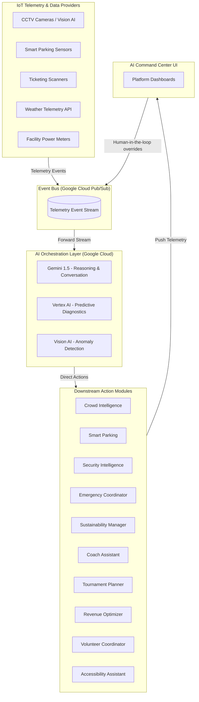
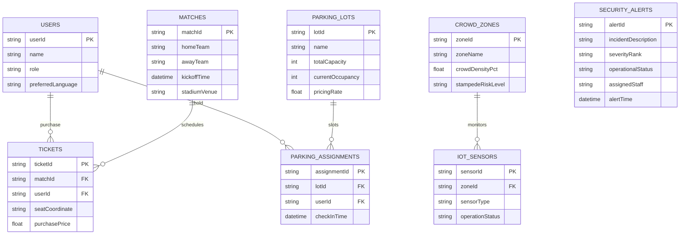
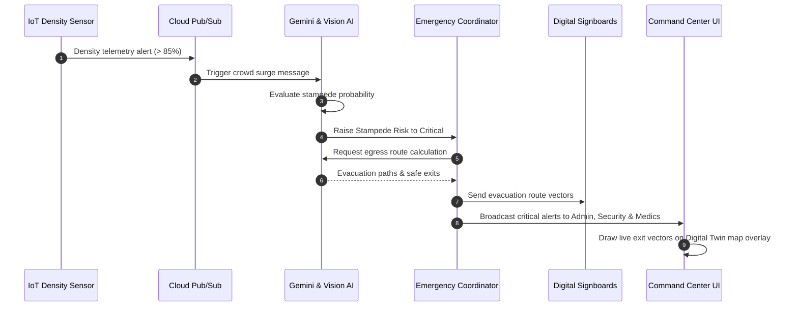
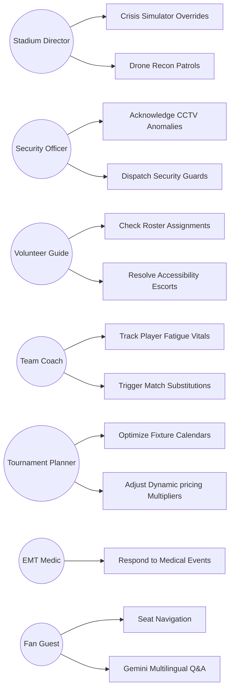
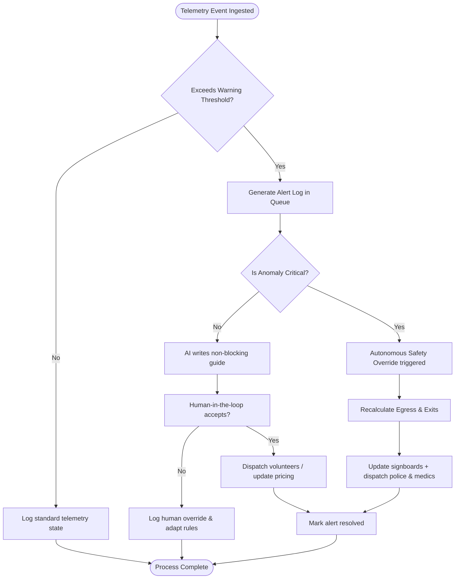

# StadiumMind AI — Architecture & Systems Design

This document details the system topology, database schemas, message flows, use cases, and decision logic for **StadiumMind AI**, a tournament-scale smart stadium operating system.

---

## 1. High-Level Event-Driven Architecture
StadiumMind AI uses a shared **Event Bus** (implemented via Google Cloud Pub/Sub in production) as its central backbone. All telemetry providers (cameras, ticketing turnstiles, IoT meters) publish messages to the bus. The **AI Orchestration Layer** reasons over these events and triggers workflows in downstream modules.

---

## 2. Database Entity-Relationship (ER) Model
The database is structured in Google Cloud Firestore. The diagram below illustrates the relationships between core operational collections.

---

## 3. Incident Evacuation Sequence
This sequence diagram demonstrates the flow of events during a crowd surge or stampede warning.

---

## 4. Role-Based Use Cases
StadiumMind AI splits operational capabilities across seven distinct user roles to maintain tight access control:

---

## 5. Autonomous Incident Mitigation Decision Flow
This flowchart details how the AI Decision Engine evaluates, alerts, and resolves anomalies automatically without causing operational gridlock.

---

## 6. Development & Deployment Roadmap

1. **Now (Hackathon Core Nucleus)**:
   - Stateful simulation environment mapping 15 operational modules.
   - Live Gemini Conversational API client.
   - split-screen 2.5D interactive Digital Twin map.
2. **Next (Production Sensor Binding)**:
   - Bind CCTV streams to Google Cloud Vision AI API.
   - Configure live Cloud Pub/Sub topics to replace mock simulation loops.
3. **Future (Enterprise Scalability)**:
   - Deploy edge computing nodes at stadiums to run vision inference locally with sub-second latencies.
   - Extend the coach assistant modules into wearable biometric trackers.
